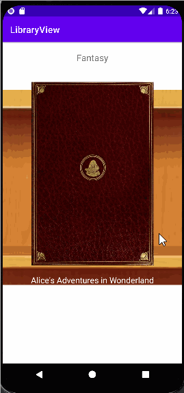

# AND101 Milestone 2 - **LibraryView**

Submitted by:
- **Yiyi Huang**

Time spent: **15** hours spent in total

## Summary

This document provides a summary of our project building process for our app, **LibraryView**

## Milestone Requirements

<!-- Please be sure to change the [ ] to [x] for any features you completed.  If a feature is not checked [x], you might miss the points for that item! -->

The following REQUIRED features are completed:

- [x] Assign features to each member of your group
- [x] Establish a goal time for completing each feature

The following REQUIRED files are included:

- [x] Updated 📄 `project_spec.md`, which contains:
  - [X] App Overview (Milestone 1)
  - [X] App Spec (Milestone 1)
  - [x] Checked off 2+ completed features
  - [x] 2+ Videos/GIFs of build progress

- [x] Our 🎥 Demo Video (Only a gif for this example project)
  - [x] We have also added the Demo Video Link to the Group Info Form on the course portal.

## 🎥 Demo Video

Here's a video that demos all of the app's implemented features:

VIDEO created with **LICEcap**

## Notes

Here's a place for any other notes on this milestone!
