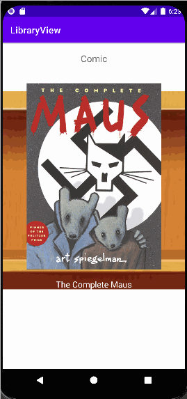

# **LibraryView**

## Table of Contents

1. [App Overview](#App-Overview)
1. [Product Spec](#Product-Spec)
1. [Wireframes](#Wireframes)
1. [Build Notes](#Build-Notes)

## App Overview

### Description 

**App that allows avid readers to find books in a similar fashion to a traditional library**

### App Evaluation

<!-- Evaluation of your app across the following attributes -->
   - **Category:** Entertainment
   - **Mobile:** Mobile is essential for this because this allows users to have a digital library at their finger tips. Also the act of looking for books is a very casual task that can be done remotely and on-the-go.
   - **Story:** Creates a digital environment that is reminiscent of the traditional library experience.
   - **Market:** Anyone who is interested in books, especially traditional libraries. 
   - **Habit:** After finishing one book, users can look back to the app to find their next read.
   - **Scope:** V1 would allow users to look at a simple view of a library and search for books by category. V2 would allow users to get a digital copy of the books from this app. V3 would incorporate a movable view of the library for an immersive experience.

## Product Spec

### 1. User Features (Required and Optional)

Required Features:

- Main page with shelves separated by book category
- Clickable categories that bring user to a shelf view
- Shelf view displays books in the chosen category

Stretch Features:

- 
- Allow users to click and move an avatar in the library

### 2. Chosen API(s)

- http://openlibrary.org/subjects/$subject.json
  - Shelf view displays books in the chosen category

### 3. User Interaction

Required Feature

- click on category
  - => opens page to recycler view with list of books
- scroll through list of books
  - => see more books

## Wireframes

<!-- Add picture of your hand sketched wireframes in this section -->

## Build Notes

Here's a place for any other notes on the app, it's creation 
process, or what you learned this unit!  

## License

Copyright **2023** **Yiyi Huang**

Licensed under the Apache License, Version 2.0 (the "License");
you may not use this file except in compliance with the License.
You may obtain a copy of the License at

    http://www.apache.org/licenses/LICENSE-2.0

Unless required by applicable law or agreed to in writing, software
distributed under the License is distributed on an "AS IS" BASIS,
WITHOUT WARRANTIES OR CONDITIONS OF ANY KIND, either express or implied.
See the License for the specific language governing permissions and
limitations under the License.
